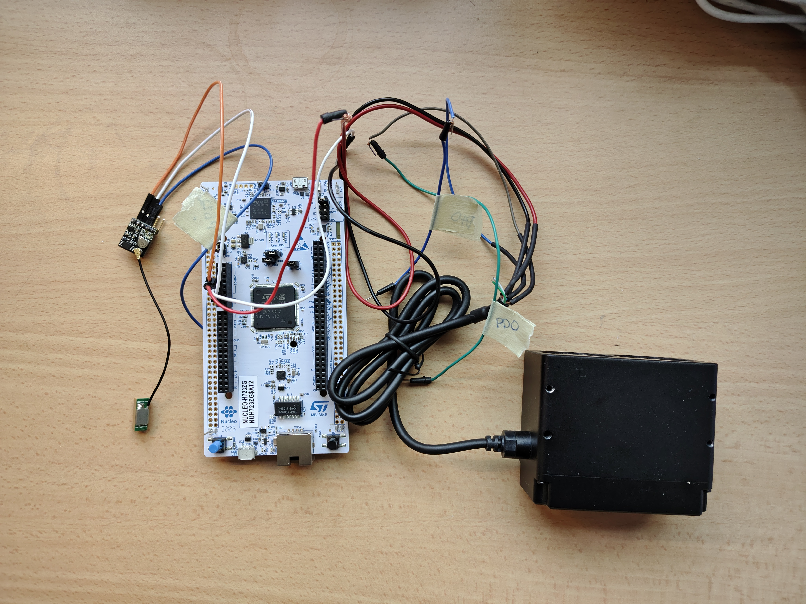
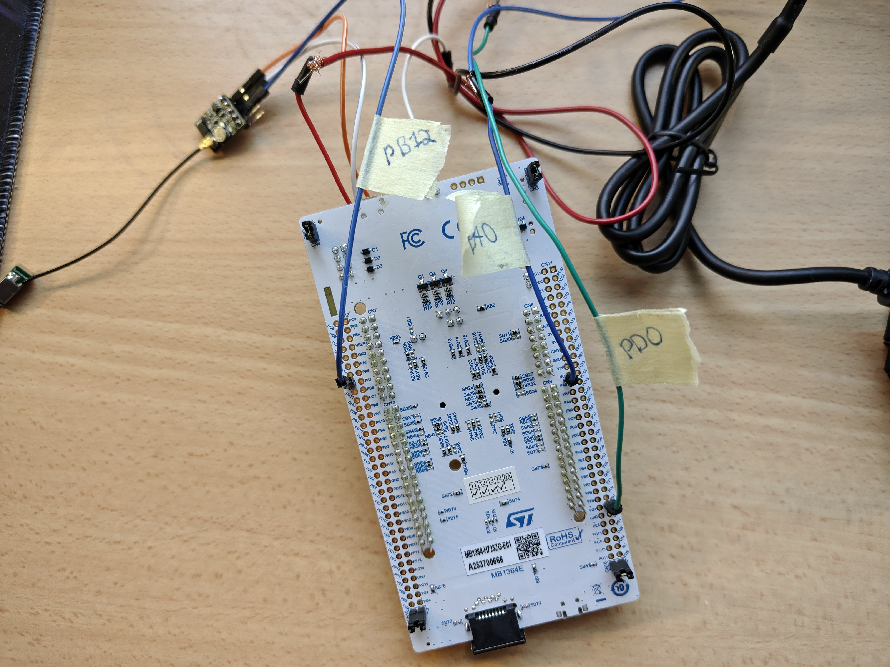

# STM32 sensor integration
In this project, I connect the Nucleo-H723ZG development board with a LiDAR sensor and a GPS module. The Nucleo communicates with both modules using the UART protocol and transmits data through USB. This data can be read using Python using a computer.


## Components used:
- NUCLEO-H723ZG
- DFRobot TEL0132 (GPS + BDS BeiDou Dual Module)
- Benewake TF350 Long-range single-point LiDAR 


## Software Requirements
- Python 3.x
- STM32 Cube IDE
- STM32 CubeMX


## Wiring
Both modules use the UART protocol. This means that the modules communicate through two wires, RX (Recieve) and TX (Transmit) pins. Each pin has to connect to its counterpart. Example: TX pin on the TF350 will connect to the RX pin on the Nucleo,

#### Power
Both the TEL0132 and the TF350 work on 3.3V or 5V. Give each one of them a GND pin too.

#### TF350
This is the LiDAR sensor, it requires a RX and TX pin. The STM32 will send a measurement command through the TX pin and recieve measurement data from the RX pin. The default baud rate is 115200, though this can be configured through the command editing.

Expected data: 9 bytes. These can be used in the following formula to get distance in centimetres.
$ Distance (cm) = Byte_2 + (Byte_3 \times 256) $

#### TEL0132
This is the GPS module. It automatically captures the location without needing any extra code. For that reason, only a RX pin is needed. The default baud rate is 9600. Do note that the sensor works best outside, or at least near a window.

Expected data: Three NMEA 0183 sentences.
```$GNGGA```: Global Positioning System Fix Data
```$GNGLL```: Geographic Position - Latitude/Longitude
```$GPGSA```: GNSS DOP and Active Satellites

#### Pin-map
| Component | Sensor Pin | Nucleo Pin (Target) | Function | Baud Rate |
| :--- | :--- | :--- | :--- | :--- |
| **TF350** | TX (Blue) | **RX (PA0)** | Receive Distance Data | 115200 |
| **TF350** | RX (Green) | **TX (PD0)** | Send Commands | 115200 |
| **TEL0132** | TX | **RX (PB12)** | Receive NMEA Data | 9600 |
| **Power** | VCC | **5V or 3.3V** | Power Supply | ― |
| **Ground** | GND | **GND** | Common Ground | ― |

##### Power Wiring


#### UART Wiring



## Instructions
1. Connect your Nucleo-H723ZG to your computer.
2. Install "STM32 Communication Test.zip" and unzip. Open the project in "STM32 Cube IDE".
3. Make sure the Nucleo is seen in the IDE. Update if neccesary.
4. Connect your wires and upload the code to the STM32.
5. Open "STM32 python communication.py".
6. Edit the COM port to match yours. You can check which one it is in "Device manager" (for Windows).
7. Run code.

Note: Using the Python code will take up the COM port. The Serial Monitor can only be viewed by one program at a time, trying to have two programs will make the second one fail to open the port.
